  <picture><source media="(prefers-color-scheme: dark)" srcset="assets/oss-builder/hero.svg"></picture>

  <picture><source media="(prefers-color-scheme: dark)" srcset="assets/oss-builder/scan.svg"></picture>

  <a href="https://github.com/Mahdi-Shafiei-IRAN?tab=repositories"><picture><source media="(prefers-color-scheme: dark)" srcset="assets/oss-builder/projects.svg"></picture></a>

  <picture><source media="(prefers-color-scheme: dark)" srcset="assets/oss-builder/stack.svg"></picture>

  <a href="https://github.com/Mahdi-Shafiei-IRAN">GitHub</a> · <a href="https://linkedin.com/in/mahdi-shafiei-iran">LinkedIn</a>

<!-- theme: oss-builder · generated 2026-09-30 -->
